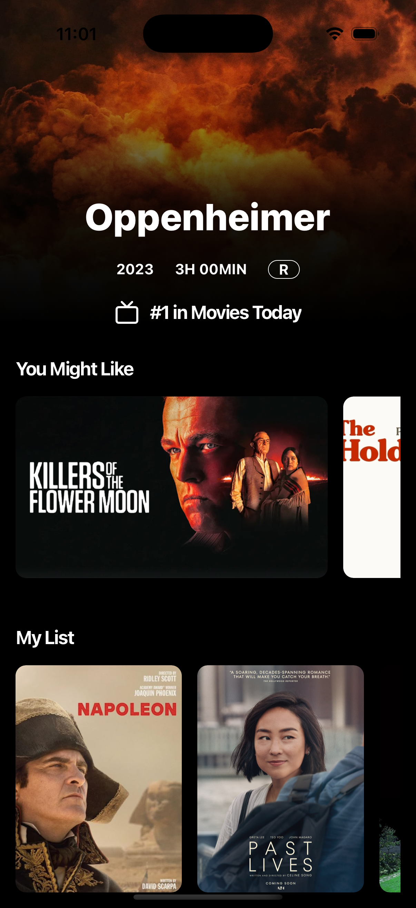
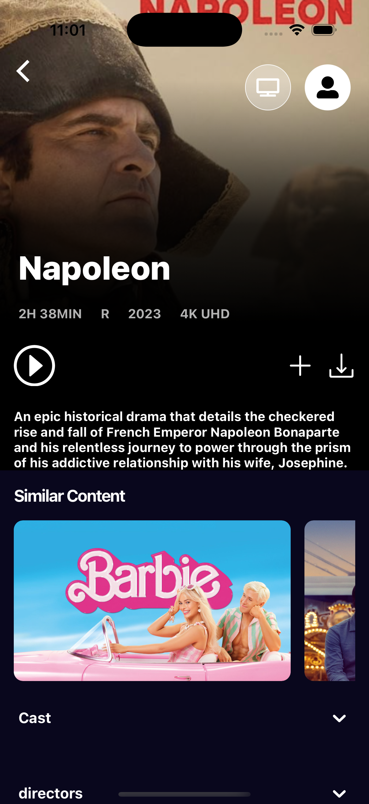
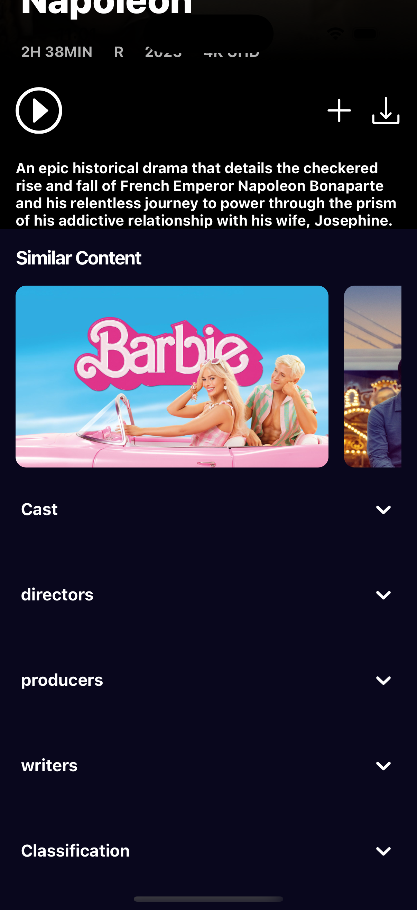

# 🎬 Streaming App

> Technical test project for the React Native Developer position at Quasar Solutions.  
> Built with **Expo**, **React Native**, and **TypeScript** by Cristian Suar.

---

## 🖼️ Preview

A continuación se muestran algunas vistas de la app:

### 🎬 Home Screen



---

### 🎥 Details Banner



---

### 🎞️ Detials Sections



---

## 🚀 Requirements

Before starting, make sure you have installed:

- **Node.js** (version 18+ recommended)
- **Yarn** (optional – or use npm)
- **Expo CLI**  
  Install globally:

  ```bash
  npm install -g expo-cli

## 🏡 Installation

Clone this repository:

```bash
git clone git@github-personal:IsseiSuar/streaming-app-cs.git
cd streaming-app-cs
```

Install dependencies 

```bash
npm install
# or
yarn
```

Start de development server

```bash
npx expo start
```

# 🧱 Proyect Structure

src/
├── screens/ #  Where the app’s main pages or views live.
├── types/ #  Typescript types to help keep things organized.
├── interfaces/ # Interfaces TypeScript (movie, request, etc.)
├── constants/ # Static values for use in the app
├── navigation/ #   Setup for moving between screens and a global way to navigate.
├── services/ # Code that talks to APIs using Axios.
├── mock/ #  Data for testing and development the ui.
├── config/ #  Settings and variables for the app.


---

# 🧠 Architecture Decisions

- 🔄 **Navigation:** Stack navigation using `@react-navigation/native-stack`
- 🧭 **Global navigation ref:** For navigating from components outside screen context
- 📦 **ApiService:** Centralized Axios service with dynamic `baseURL` support
- 💡 **Feature-first structure:** For scalability and separation of concerns
- ⚙️ **Type-safe:** Fully typed routes and API data with TypeScript

---

# ✅ Features Implemented

- Home screen layout with featured banner
- Dynamic data fetching from JSON API mock
- Reusable `Section` and `MovieCard` components
- Responsive horizontal scroll
- Navigation structure ready to use
- Global navigation access from non-screen components

